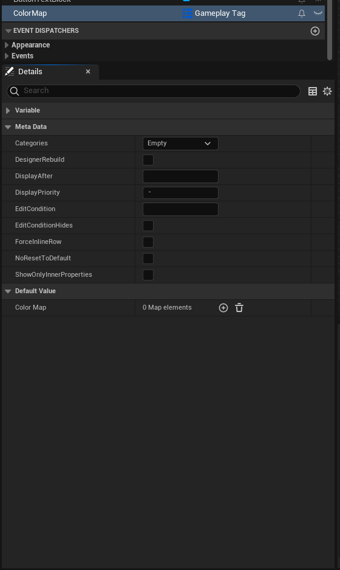
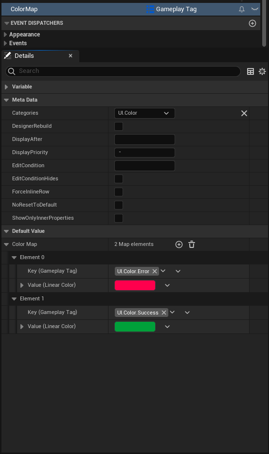
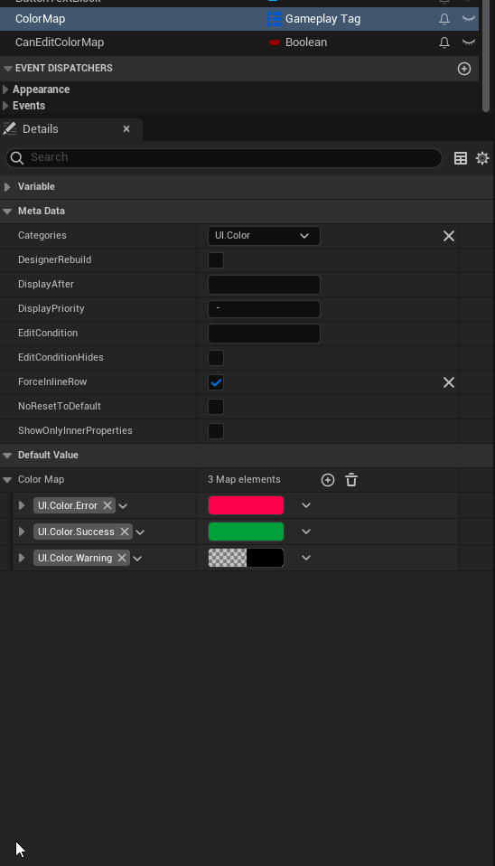
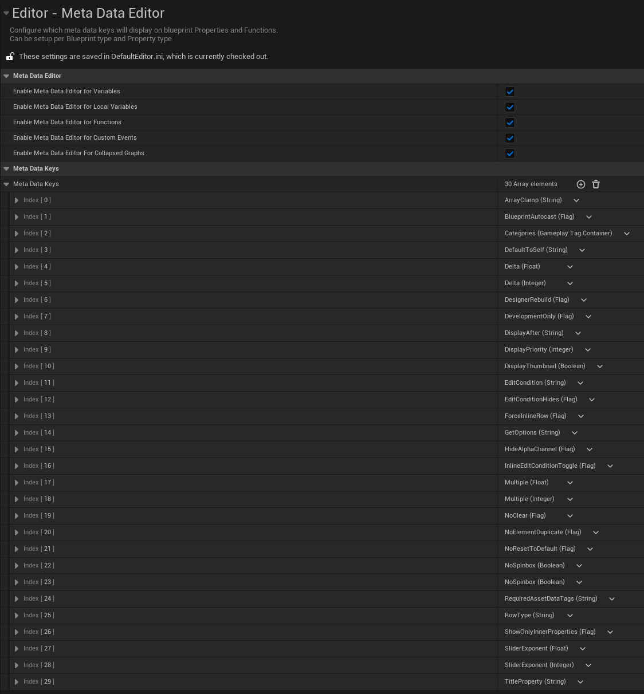
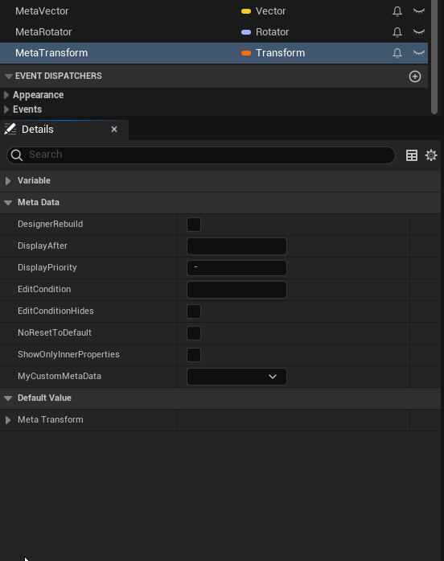

# MDMetaDataEditor

MDMetaDataEditor enables editing the meta data of Blueprint-created variables, function parameters, functions, events, macros, and collapsed graphs.

Supports Unreal Engine 5.1 and later.

## Editing Meta Data

The plugin adds a new `Meta Data` section to the details panel of Blueprint Variables, Functions, Events, Function Parameters, Structs and Struct Properties. Here, any exposed meta data values can be set.

### Advanced

An advanced raw meta data editor can be enabled via Editor Preferences -> General -> Meta Data Editor (Local Only). This will enabling the raw strings of key-value meta data pairs.

## Configuring Meta Data Keys
By default, the plugin comes with some common meta data keys pre-configured.
The list of available Meta Data Keys that are exposed to Blueprint can be configured in **Project Settings -> Editor -> Meta Data Editor**.

Here, Meta Data Keys can be added, removed, and modified. By default, new keys are set up to work for any variable type in any blueprint.

The **Key Type** should match the expected type of the meta data key, that will also determine which widget is displayed for setting the value of the meta data.

For Meta Data Keys meant only for functions, the **Supported Property Types** list should be empty and have **Can be Used by Functions** checked.

See these pages for documentation on various meta data options:
- [benui's all UPROPERTY specifiers](https://benui.ca/unreal/uproperty/)
- [benui's all UFUNCTION specifiers](https://benui.ca/unreal/ufunction/)
- [benui's all UPARAM specifiers](https://benui.ca/unreal/uparam/)
- [Unreal Engine 5.2 UProperty specifiers](https://docs.unrealengine.com/5.2/en-US/unreal-engine-uproperty-specifiers/#metadataspecifiers)
- [Unreal Engine 5.3 Function specifiers](https://docs.unrealengine.com/5.3/en-US/ufunctions-in-unreal-engine/#metadataspecifiers)

## FYI

* If a meta data key is removed from the Project Settings, or the specific meta data type is disabled, that meta data key will continue to exist on variables, functions, events, and parameters.

* I couldn't find any useful Meta Data Keys for collapsed graphs/macros so I disabled it by default. It can be re-enabled in the Project Settings.
